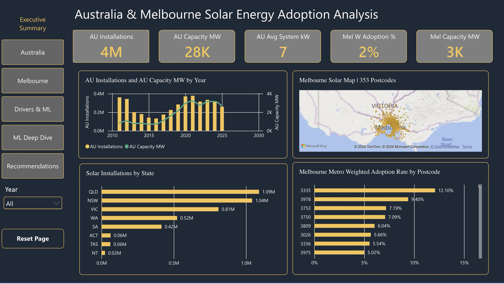
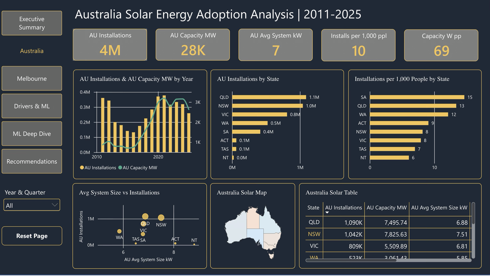
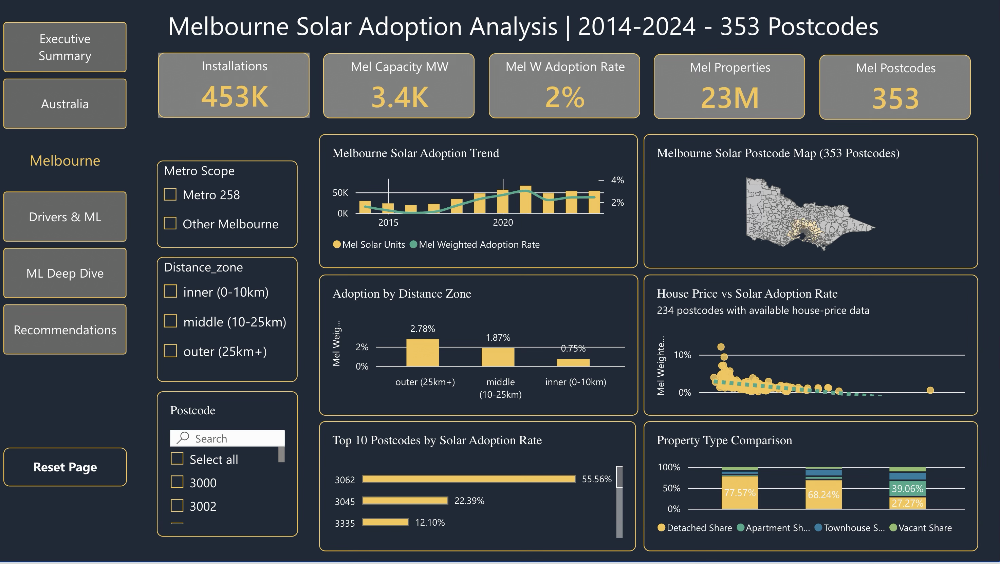
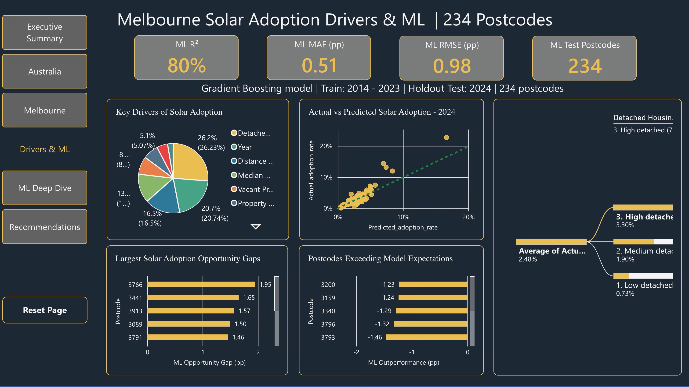
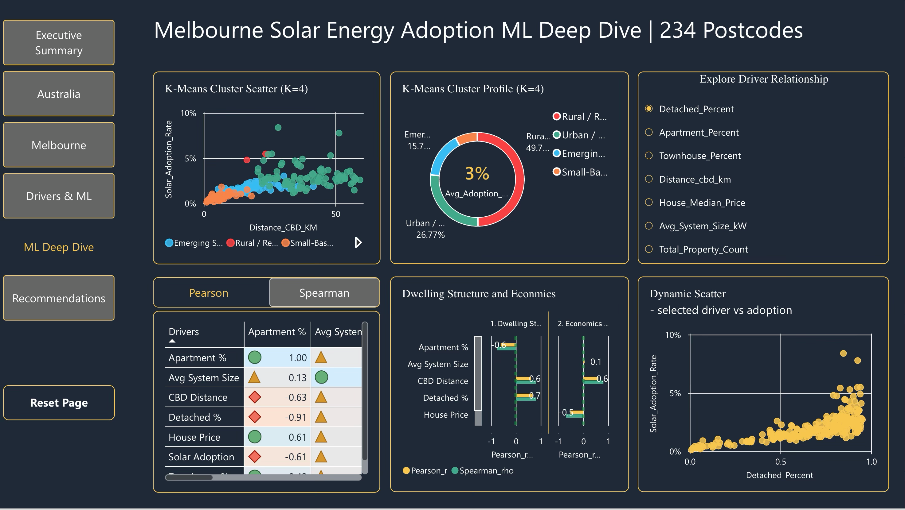
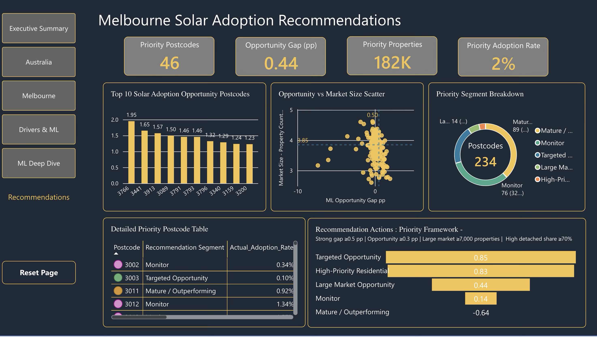

# solar-adoption-australia-analytics-powerbi

The project combines national solar trends with a Melbourne postcode-level analysis to explore how housing, geography and property characteristics relate to solar adoption.

Using data from 353 Melbourne postcodes, with a refined subset of 234 postcodes where house-price data was available for machine learning, I applied:
- Gradient Boosting Regression to predict solar adoption
- K-Means Clustering to segment similar postcodes
- Pearson and Spearman correlation analysis with significance testing
- Power BI for interactive reporting and recommendations

The Gradient Boosting model achieved an R² of approximately 0.80 and an MAE of approximately 0.51 percentage points on the 2024 holdout dataset.
The analysis identified relationships between solar adoption and factors including detached housing, distance from the CBD, apartment and townhouse concentration, and property prices.

I also developed an opportunity framework to identify postcodes where solar adoption is below model expectations, while considering market size and housing characteristics. This helped move the analysis from: 

“What is happening?” → “Where should we focus next?”

What a valuable experience in combining data engineering, analytics, machine learning and visual storytelling into one decision-focused solution with with actionable recommendations.

Tools: Power BI | DAX | Power Query | Python | Pandas | Scikit-learn

</> Markdown

